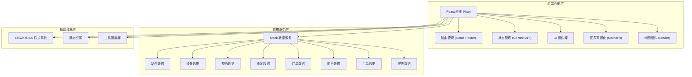
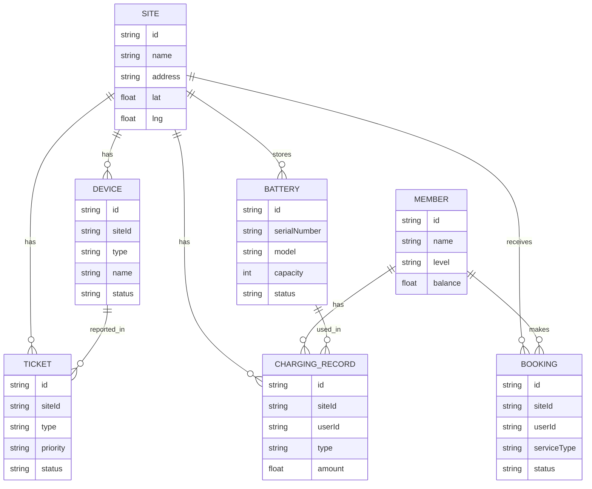

## 1. 架构设计



## 2. 技术描述

- **前端框架**: React@18 + TypeScript
- **构建工具**: Vite@5
- **样式方案**: TailwindCSS@3 + PostCSS
- **路由管理**: React Router@6
- **图表库**: Recharts@2
- **地图库**: Leaflet@1.9 + react-leaflet
- **图标库**: Lucide React
- **状态管理**: React Context API + useReducer
- **日期处理**: date-fns
- **数据模拟**: Mock 数据 + TypeScript 类型定义

## 3. 路由定义

| 路由路径 | 页面名称 | 用途 |
|----------|----------|------|
| / | 站点地图 | 首页，展示地图和站点搜索 |
| /devices | 设备状态 | 设备实时状态监控 |
| /bookings | 预约排队 | 预约管理和队列查看 |
| /batteries | 电池库存 | 电池库存管理和盘点 |
| /records | 充电记录 | 充电/换电历史记录 |
| /members | 会员账户 | 会员管理和账户信息 |
| /tickets | 异常工单 | 工单处理和故障管理 |
| /reports | 经营报表 | 数据统计和经营分析 |

## 4. 目录结构

```
src/
├── assets/              # 静态资源
│   ├── images/
│   └── icons/
├── components/          # 公共组件
│   ├── layout/         # 布局组件
│   │   ├── Sidebar.tsx
│   │   ├── Header.tsx
│   │   └── MainLayout.tsx
│   ├── ui/             # 基础 UI 组件
│   │   ├── Button.tsx
│   │   ├── Card.tsx
│   │   ├── Table.tsx
│   │   ├── Modal.tsx
│   │   ├── Tabs.tsx
│   │   └── StatusBadge.tsx
│   └── charts/         # 图表组件
├── pages/              # 页面组件
│   ├── SiteMap.tsx
│   ├── DeviceStatus.tsx
│   ├── BookingQueue.tsx
│   ├── BatteryInventory.tsx
│   ├── ChargingRecords.tsx
│   ├── MemberAccount.tsx
│   ├── ExceptionTickets.tsx
│   └── BusinessReports.tsx
├── data/               # Mock 数据
│   ├── sites.ts
│   ├── devices.ts
│   ├── bookings.ts
│   ├── batteries.ts
│   ├── records.ts
│   ├── members.ts
│   ├── tickets.ts
│   └── reports.ts
├── types/              # TypeScript 类型定义
│   └── index.ts
├── utils/              # 工具函数
│   ├── format.ts
│   └── date.ts
├── context/            # 状态管理
│   └── AppContext.tsx
├── router/             # 路由配置
│   └── index.tsx
├── App.tsx
├── main.tsx
└── index.css
```

## 5. 数据模型

### 5.1 核心数据类型定义

```typescript
// 站点
interface Site {
  id: string;
  name: string;
  address: string;
  lat: number;
  lng: number;
  serviceTypes: ('charging' | 'battery-swap')[];
  totalChargers: number;
  availableChargers: number;
  totalBatteries: number;
  availableBatteries: number;
  businessHours: string;
  queueCount: number;
  status: 'active' | 'maintenance' | 'offline';
}

// 设备
interface Device {
  id: string;
  siteId: string;
  siteName: string;
  type: 'charger' | 'battery-cabinet';
  name: string;
  model: string;
  status: 'online' | 'offline' | 'fault' | 'in-use';
  power?: number;
  currentBattery?: number;
  lastMaintenance: string;
}

// 预约
interface Booking {
  id: string;
  siteId: string;
  siteName: string;
  userId: string;
  userName: string;
  serviceType: 'charging' | 'battery-swap';
  timeSlot: string;
  status: 'pending' | 'confirmed' | 'in-progress' | 'completed' | 'cancelled' | 'no-show';
  queueNumber: number;
  estimatedWaitTime: number;
  createdAt: string;
}

// 电池
interface Battery {
  id: string;
  serialNumber: string;
  model: string;
  capacity: number;
  currentLevel: number;
  healthStatus: number;
  status: 'available' | 'charging' | 'in-use' | 'maintenance' | 'retired';
  siteId: string;
  location: string;
  lastSwapTime?: string;
  cycleCount: number;
}

// 充电记录
interface ChargingRecord {
  id: string;
  siteId: string;
  siteName: string;
  userId: string;
  userName: string;
  type: 'charging' | 'battery-swap';
  startTime: string;
  endTime?: string;
  duration?: number;
  energyDelivered?: number;
  batteryBefore?: number;
  batteryAfter?: number;
  amount: number;
  status: 'charging' | 'completed' | 'failed';
}

// 会员
interface Member {
  id: string;
  name: string;
  phone: string;
  level: 'normal' | 'silver' | 'gold' | 'platinum';
  discountRate: number;
  balance: number;
  deposit: number;
  points: number;
  totalOrders: number;
  totalSpent: number;
  joinDate: string;
}

// 工单
interface Ticket {
  id: string;
  siteId: string;
  siteName: string;
  deviceId?: string;
  deviceName?: string;
  type: 'device-fault' | 'battery-issue' | 'timeout-occupancy' | 'other';
  priority: 'low' | 'medium' | 'high' | 'urgent';
  status: 'open' | 'processing' | 'resolved' | 'closed';
  title: string;
  description: string;
  reporter: string;
  assignee?: string;
  createdAt: string;
  resolvedAt?: string;
}

// 报表数据
interface ReportData {
  date: string;
  totalOrders: number;
  totalRevenue: number;
  chargingOrders: number;
  swapOrders: number;
  avgOrderValue: number;
  newMembers: number;
  siteUtilization: number;
}
```

### 5.2 数据关系图


